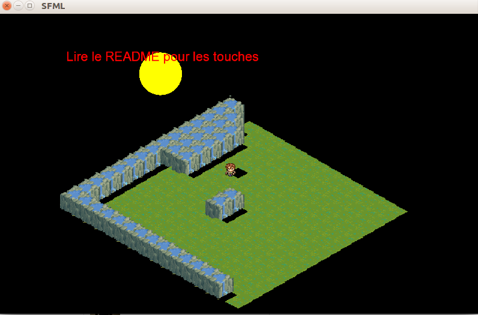

install SFML:

sudo apt-get install libsfml-dev

compil and execute : 

g++ -c Texte.cpp Texte.h Grid.cpp Keypush.cpp Character.cpp Playable.cpp Interface.cpp 

 g++ Texte.o Grid.o Playable.o Keypush.o Character.o Interface.o -o sfml-app -lsfml-graphics -lsfml-window -lsfml-system
 
./sfml-app

or : 

bash execute.sh 

Capture ecran :

=======Touches Clavier ============.
les fleches deplacent le personnage.

  z=bouge camera vers le haut
q=bouge camera vers le gauche
 s=bouge camera vers le bas
 d=bouge camera vers le droite
 
 a = zoom avant
 e = zoom arriere
 
 u= rotation de la MAP incrementant de 5 degres.
 
